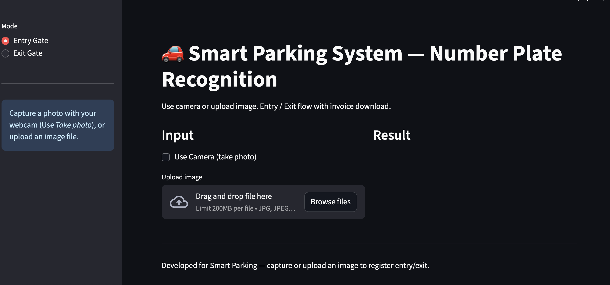
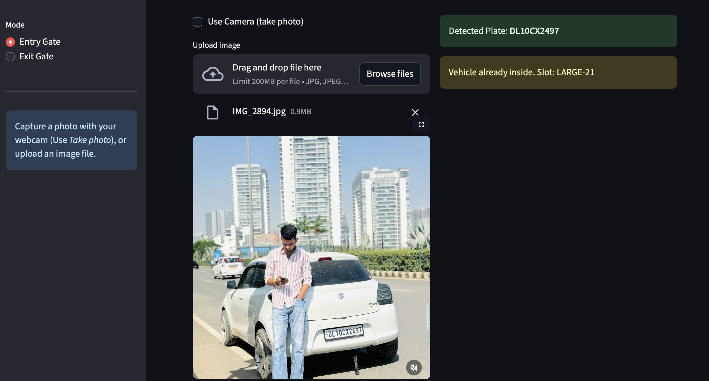
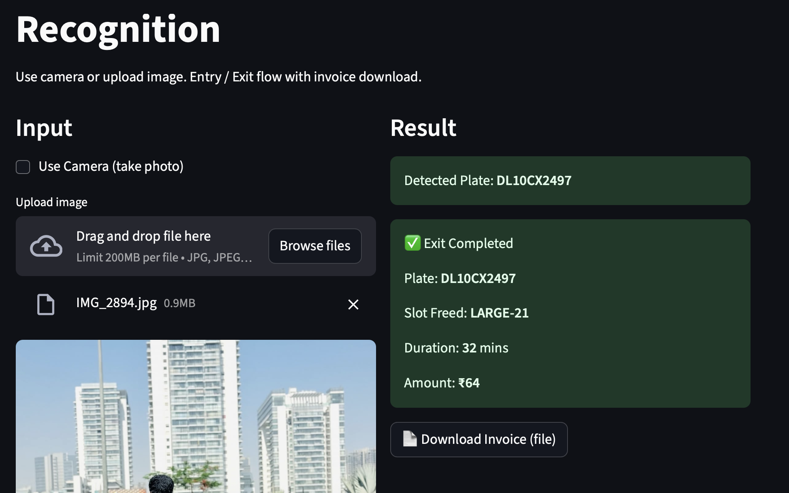

## **Smart AI-Powered Parking System**

An end-to-end automated parking management system that detects vehicles, reads number plates, identifies vehicle types, and assigns parking slots — all in real time using YOLOv8, Streamlit, and OCR.

### Features
* Real-time vehicle detection (YOLOv8)
* Automatic number plate detection
* OCR-based plate recognition (EasyOCR)
* Vehicle type classification (small / medium / large)
* Smart slot assignment
*  Entry & exit logging
* Live camera capture inside Streamlit
* Dashboard to view all logs

### **Tech Stack**

| Component              | Technology              |
| ---------------------- | ----------------------- |
| Vehicle Detection      | YOLOv8 (Ultralytics)    |
| Number Plate Detection | YOLOv8 (separate model) |
| OCR for Reading Plate  | EasyOCR                 |
| Frontend/UI            | Streamlit               |
| Backend Logic          | Python                  |
| Live Video             | OpenCV                  |

### *Entry Gate* 

### *Exist Gate*

### Requirements 
pip install -r requirements.txt

### INPUT SOURCES
* Live Webcam
* Pre-recorded Videos
* Uploaded Images

### OUTPUT PROVIDED

* Vehicle type
* License plate number
* Slot assigned
* Timestamp
* Entry/Exit logs

